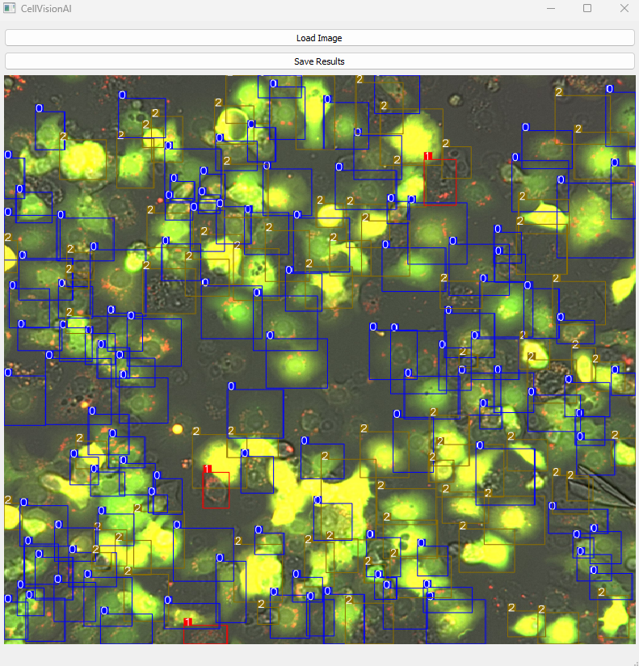

**CellVisionAI** is a Windows desktop app for automated cell image analysis using deep learning.

No installation required — just download and run the `.exe`.

---

## 📥 Download

**[Click here to download the app](https://drive.google.com/file/d/1kqTJtL-cf6C7znYfUI2iZh55VJR-wVV-/view?usp=sharing)**

---

## How to Use

1. Run `CellVisionAI.exe`.
2. Click **“Load Image”** and select the image you want to annotate. Make sure the image is in the same folder as the `.exe`!!
3. Wait a few moments while the model processes the image.
4. The annotated image will be displayed in the app.
5. Click **“Save Results”** to export the output files.

---

 

### Classification Labels

0 - Basal Autophagy  
1 - Activated Autophagy  
2 - Unidentified  

---

## Included Files

When you save results, a `.zip` file will be generated containing:

- `*_annotated.png` — the original image with overlaid bounding boxes and classification IDs  
- `.txt` — a text file containing bounding box coordinates and classification IDs  
- `segmentation_masks/` — a folder with segmentation masks

---
