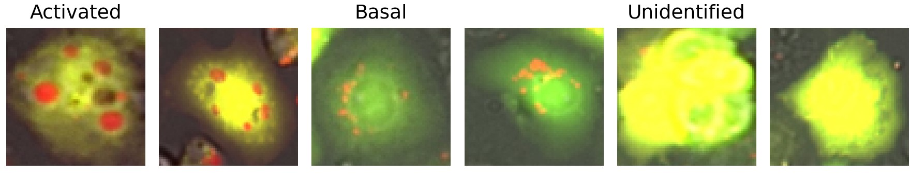

# Cell Classification

This directory focuses on the classification of cell images using VGG, ResNet, and Vision Transformer (ViT) into three different categories: basal, activated, and unidentified.



## Virtual Environment
Go to the project folder. Create a virtual environment:
```bash
python -m venv .venv
```

Activate the virtual environment:
```bash
source ./.venv/Scripts/activate
```

Install the requirements:
```bash
pip install -r requirements.txt
```

## Dataset Preparation
Download the dataset from [here](https://drive.google.com/file/d/1Ip1zDlZwIdZMy80kIBmps5sVu6uuG8K_/view?usp=sharing). This is the original data.

### Segment and Crop the Images

Run the `crop_and_segment_images.py` script, which will segment and crop all cells based on the real masks.

Next, run `merge_divide.py` to mix up the images and distribute them into train, val, test folders based on the `data_division.txt` file.

## Model Training

Run the `train.py` script. Within this script, adjust the `MODEL` variable to select your desired model (`vgg`, `vit`, `resnet`) and set the `PRETRAINED` flag to indicate whether to initiate training from scratch or use a pre-trained model as a starting point.

## Model Evaluation

To evaluate the model's performance on the test set, run the `test()` function within the `train.py` script. 

## Get Labels

For obtaining labels of each cell image in the test dataset, use the `get_labels()` function found in the `train.py` script. This step is useful for generating t-SNE plots.

### Model Checkpoints

You can download the checkpoints for the three models trained on the CELLULAR data set from [here](https://drive.google.com/drive/folders/1SQpfsqEfRrEO1e5esKhRJNG29iOavM2C?usp=sharing).


# Explainable AI
```bash
python explainable_ai.py --device=cuda --image-path='final_dataset\test\fed\Timepoint_001_220518-ST_C03_s3_0.png' --method=gradcam
```
