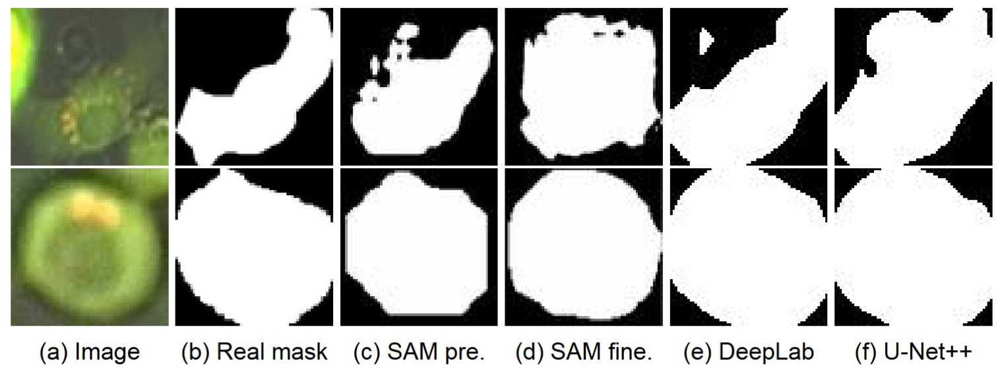

# Cell Segmentation

This repository contains a collection of projects designed for cell segmentation tasks on the CELLULAR data set. It includes several methods:

- **Cellpose:** without bounding boxes.
- **SAM:** without bounding boxes.
- **MedSAM:** with bounding boxes.
- **DeepLabV3+:** with bounding boxes.
- **UNet++:** with bounding boxes.

